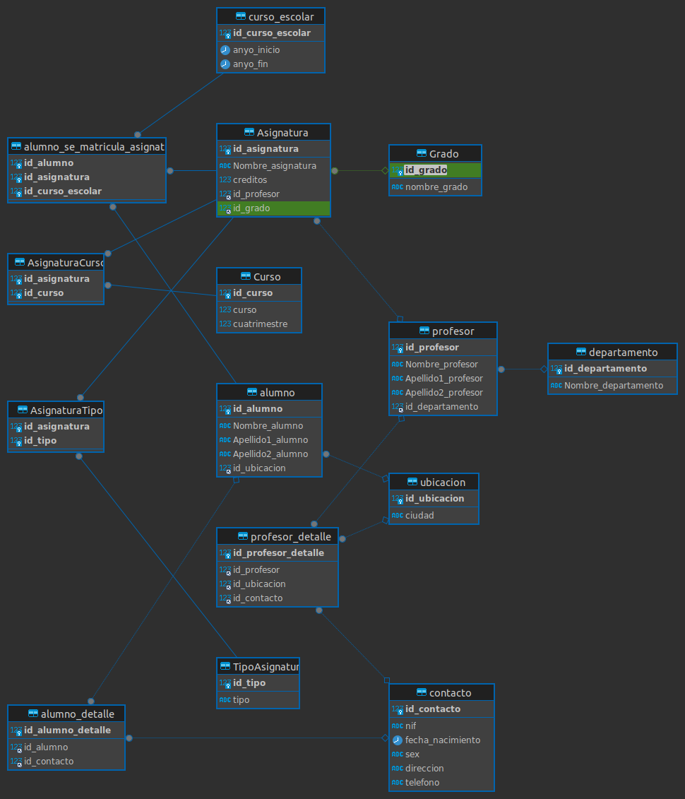

# Segunda Base De Datos <3



#### Consultas sobre una tabla

1. Devuelve un listado con el primer apellido, segundo apellido y el nombre de todos los alumnos. El listado deberá estar ordenado alfabéticamente de menor a mayor por el primer apellido, segundo apellido y nombre.

   ```sql
   SELECT Apellido1_alumno, Apellido2_alumno, Nombre_alumno
   FROM alumno
   ORDER BY  Apellido1_alumno, Apellido2_alumno, Nombre_alumno DESC;
   
   +------------------+------------------+---------------+
   | Apellido1_alumno | Apellido2_alumno | Nombre_alumno |
   +------------------+------------------+---------------+
   | Gómez            | Pérez            | Elena         |
   | López            | García           | Ana           |
   | Martínez         | Sánchez          | Pedro         |
   +------------------+------------------+---------------+
   ```

   

2. Averigua el nombre y los dos apellidos de los alumnos que no han dado de alta su número de teléfono en la base de datos.

   ```sql
   SELECT a.Apellido1_alumno, a.Apellido2_alumno, a.Nombre_alumno
   FROM alumno As a
   INNER JOIN alumno_detalle AS al ON a.id_alumno = al.id_alumno
   INNER JOIN contacto AS c  ON al.id_contacto = c.id_contacto
   WHERE c.telefono IS NULL OR c.telefono = '';
   
   +------------------+------------------+---------------+
   | Apellido1_alumno | Apellido2_alumno | Nombre_alumno |
   +------------------+------------------+---------------+
   | Gómez            | Pérez            | Elena         |
   +------------------+------------------+---------------+
   ```

   

3. Devuelve el listado de los alumnos que nacieron en 1999.

   ```sql
   SELECT a.Apellido1_alumno, a.Apellido2_alumno, a.Nombre_alumno, c.fecha_nacimiento
   FROM alumno As a
   INNER JOIN alumno_detalle AS al ON a.id_alumno = al.id_alumno
   INNER JOIN contacto AS c  ON al.id_contacto = c.id_contacto
   WHERE YEAR(c.fecha_nacimiento) = 1999;
   
   +------------------+------------------+---------------+------------------+
   | Apellido1_alumno | Apellido2_alumno | Nombre_alumno | fecha_nacimiento |
   +------------------+------------------+---------------+------------------+
   | López            | García           | Ana           | 1999-05-15       |
   +------------------+------------------+---------------+------------------+
   ```

   

4. Devuelve el listado de profesores que no han dado de alta su número de teléfono en la base de datos y además su nif termina en x.

   ```sql
   SELECT p.Nombre_profesor, p.Apellido1_profesor, p.Apellido2_profesor
   FROM profesor AS p
   INNER JOIN profesor_detalle AS pd ON p.id_profesor = pd.id_profesor
   INNER JOIN contacto AS c ON pd.id_contacto = c.id_contacto
   WHERE c.telefono IS NULL OR c.telefono = ''
   AND c.nif LIKE '%x';
   
   
   +-----------------+--------------------+--------------------+
   | Nombre_profesor | Apellido1_profesor | Apellido2_profesor |
   +-----------------+--------------------+--------------------+
   | Carlos          | Fernández          | Gómez              |
   +-----------------+--------------------+--------------------+
   ```

   

5. Devuelve el listado de las asignaturas que se imparten en el primer cuatrimestre, en el tercer curso del grado que tiene el identificador 7.

  ```sql
  SELECT a.Nombre_asignatura
  FROM Asignatura AS a
  INNER JOIN AsignaturaCurso AS ac ON a.id_asignatura = ac.id_asignatura
  INNER JOIN Curso AS c ON ac.id_curso = c.id_curso
  WHERE c.cuatrimestre = 1 
  AND c.curso = 3 
  AND a.id_grado = 7;
  
  Program did not output anything!
  ```

  

  #### Consultas multitabla (Composición interna)

  1. Devuelve un listado con los datos de todas las alumnas que se han matriculado alguna vez en el Grado en Ingeniería Informática (Plan 2015).

     ```sql
     SELECT a.id_alumno, a.Nombre_alumno, a.Apellido1_alumno, a.Apellido2_alumno
     FROM alumno a
     JOIN alumno_detalle ad ON a.id_alumno = ad.id_alumno
     JOIN contacto c ON ad.id_contacto = c.id_contacto
     JOIN alumno_se_matricula_asignatura asm ON a.id_alumno = asm.id_alumno
     JOIN Asignatura asign ON asm.id_asignatura = asign.id_asignatura
     JOIN Grado g ON asign.id_grado = g.id_grado
     JOIN curso_escolar ce ON asm.id_curso_escolar = ce.id_curso_escolar
     WHERE c.sex = 'M' 
     AND g.nombre_grado = 'Ingeniería Informática'
     AND ce.anyo_inicio = 2015
     ;
     
     +-----------+---------------+------------------+------------------+
     | id_alumno | Nombre_alumno | Apellido1_alumno | Apellido2_alumno |
     +-----------+---------------+------------------+------------------+
     |         2 | Elena         | Gómez            | Pérez            |
     +-----------+---------------+------------------+------------------+
     ```

  2. Devuelve un listado con todas las asignaturas ofertadas en el Grado en Ingeniería Informática (Plan 2015).

     ```sql
     SELECT a.id_asignatura, a.Nombre_asignatura, a.creditos
     FROM Asignatura a
     JOIN Grado g ON a.id_grado = g.id_grado
     WHERE g.nombre_grado = 'Ingeniería Informática';
     
     +---------------+------------------------+----------+
     | id_asignatura | Nombre_asignatura      | creditos |
     +---------------+------------------------+----------+
     |             2 | Programación Avanzada  |        8 |
     +---------------+------------------------+----------+
     ```

  3. Devuelve un listado de los profesores junto con el nombre del departamento al que están vinculados. El listado debe devolver cuatro columnas, primer apellido, segundo apellido, nombre y nombre del departamento. El resultado estará ordenado alfabéticamente de menor a mayor por los apellidos y el nombre.

     ```sql
     SELECT  p.Apellido1_profesor, p.Apellido2_profesor , p.Nombre_profesor , d.Nombre_departamento
     FROM  profesor p
     JOIN departamento d ON p.id_departamento = d.id_departamento
     ORDER BY  p.Apellido1_profesor ASC, p.Apellido2_profesor ASC,  p.Nombre_profesor ASC;
     
     
     +--------------------+--------------------+-----------------+------------------------------+
     | Apellido1_profesor | Apellido2_profesor | Nombre_profesor | Nombre_departamento          |
     +--------------------+--------------------+-----------------+------------------------------+
     | García             | López              | Juan            | Departamento de Matemáticas  |
     | Martínez           | Pérez              | María           | Departamento de Informática  |
     +--------------------+--------------------+-----------------+------------------------------+
     ```
     
  4. Devuelve un listado con el nombre de las asignaturas, año de inicio y año de fin del curso escolar del alumno con nif 26902806M.

     ```sql
     SELECT A.Nombre_asignatura, CE.anyo_inicio, CE.anyo_fin
     FROM alumno AS AL
     JOIN alumno_detalle AS AD ON AL.id_alumno = AD.id_alumno
     JOIN contacto AS C ON AD.id_contacto = C.id_contacto
     JOIN alumno_se_matricula_asignatura AS AMSA ON AL.id_alumno = AMSA.id_alumno
     JOIN Asignatura AS A ON AMSA.id_asignatura = A.id_asignatura
     JOIN curso_escolar AS CE ON AMSA.id_curso_escolar = CE.id_curso_escolar
     WHERE C.nif = '26902806M';
     ```
     
  5. Devuelve un listado con el nombre de todos los departamentos que tienen profesores que imparten alguna asignatura en el Grado en Ingeniería Informática (Plan 2015).

     ```sql
     SELECT d.Nombre_departamento
     FROM departamento d
     JOIN profesor p ON d.id_departamento = p.id_departamento
     JOIN Asignatura a ON p.id_profesor = a.id_profesor
     JOIN Grado g ON a.id_grado = g.id_grado
     WHERE g.nombre_grado = 'Ingeniería Informática' ;
     
     +------------------------------+
     | Nombre_departamento          |
     +------------------------------+
     | Departamento de Informática  |
     +------------------------------+
     ```
     
  6. Devuelve un listado con todos los alumnos que se han matriculado en alguna asignatura durante el curso escolar 2018/2019.

     ```sql
     SELECT  al.Nombre_alumno, al.Apellido1_alumno, al.Apellido2_alumno
     FROM alumno al
     JOIN alumno_se_matricula_asignatura asm ON al.id_alumno = asm.id_alumno
     JOIN curso_escolar ce ON asm.id_curso_escolar = ce.id_curso_escolar
     WHERE ce.anyo_inicio = 2018 AND ce.anyo_fin = 2019;
     
     +---------------+------------------+------------------+
     | Nombre_alumno | Apellido1_alumno | Apellido2_alumno |
     +---------------+------------------+------------------+
     | Ana           | López            | García           |
     +---------------+------------------+------------------+
     ```
     
     

  

  #### Consultas multitabla (Composición externa)

  **Resuelva todas las consultas utilizando las cláusulas LEFT JOIN Y RIGHT JOIN**

1. Devuelve un listado con los nombres de todos los profesores y los departamentos que tienen vinculados. El listado también debe mostrar aquellos profesores que no tienen ningún departamento asociado. El listado debe devolver cuatro columnas, nombre del departamento, primer apellido, segundo apellido y nombre del profesor. El resultado estará ordenado alfabéticamente de menor a mayor por el nombre del departamento, apellidos y el nombre.

   ```sql
   SELECT  p.Apellido1_profesor, p.Apellido2_profesor , p.Nombre_profesor , d.Nombre_departamento
   FROM  profesor p
   JOIN departamento d ON p.id_departamento = d.id_departamento
   ORDER BY  p.Apellido1_profesor ASC, p.Apellido2_profesor ASC,  p.Nombre_profesor ASC;
   
   +--------------------+--------------------+-----------------+------------------------------+
   | Apellido1_profesor | Apellido2_profesor | Nombre_profesor | Nombre_departamento          |
   +--------------------+--------------------+-----------------+------------------------------+
   | García             | López              | Juan            | Departamento de Matemáticas  |
   | Martínez           | Pérez              | María           | Departamento de Informática  |
   +--------------------+--------------------+-----------------+------------------------------+
   ```

   

2. Devuelve un listado con los profesores que no están asociados a un departamento.

   ```sql
   SELECT p.Apellido1_profesor, p.Apellido2_profesor, p.Nombre_profesor
   FROM profesor p
   LEFT JOIN departamento d ON p.id_departamento = d.id_departamento
   WHERE d.id_departamento IS NULL;
   
   +--------------------+--------------------+-----------------+
   | Apellido1_profesor | Apellido2_profesor | Nombre_profesor |
   +--------------------+--------------------+-----------------+
   | Fernández          | Gómez              | Carlos          |
   +--------------------+--------------------+-----------------+
   ```

   

3. Devuelve un listado con los departamentos que no tienen profesores asociados.

   ```sql
   SELECT d.Nombre_departamento
   FROM departamento d
   LEFT JOIN profesor p ON d.id_departamento = p.id_departamento
   WHERE p.id_departamento IS NULL;
   
   +--------------------------+
   | Nombre_departamento      |
   +--------------------------+
   | Departamento de Historia |
   +--------------------------+
   ```

   

4. Devuelve un listado con los profesores que no imparten ninguna asignatura.

   ```sql
   SELECT p.Apellido1_profesor, p.Apellido2_profesor, p.Nombre_profesor
   FROM profesor p
   left JOIN Asignatura AS asig ON p.id_profesor = asig.id_profesor
   WHERE asig.id_profesor IS NULL;
   
   Program did not output anything!
   ```

   

5. Devuelve un listado con las asignaturas que no tienen un profesor asignado.

   ```sql
   SELECT a.id_asignatura, a.Nombre_asignatura
   FROM Asignatura a
   LEFT JOIN profesor p ON a.id_profesor = p.id_profesor
   WHERE p.id_profesor IS NULL;
   
   +---------------+-------------------+
   | id_asignatura | Nombre_asignatura |
   +---------------+-------------------+
   |             3 | Historia Antigua  |
   +---------------+-------------------+
   ```

   

6. Devuelve un listado con todos los departamentos que tienen alguna asignatura que no se haya impartido en ningún curso escolar. El resultado debe mostrar el nombre del departamento y el nombre de la asignatura que no se haya impartido nunca.

  ```sql
  SELECT d.Nombre_departamento, a.Nombre_asignatura
  FROM departamento d
  INNER JOIN profesor p ON d.id_departamento = p.id_departamento
  INNER JOIN Asignatura a ON p.id_profesor = a.id_profesor
  LEFT JOIN AsignaturaCurso ac ON a.id_asignatura = ac.id_asignatura
  WHERE ac.id_asignatura IS NULL;
  
  Program did not output anything!
  ```

  

  #### Consultas resumen

  1. Devuelve el número total de alumnas que hay.

     ```sql
     SELECT COUNT(a.id_alumno) AS total_alumnas
     FROM alumno as a
     INNER jOIN  alumno_detalle AS al ON a.id_alumno = al.id_alumno
     INNER JOIN contacto AS c ON al.id_contacto = c.id_contacto
     WHERE c.sex = 'M';
     
     +---------------+
     | total_alumnas |
     +---------------+
     |             1 |
     +---------------+
     ```

     

  2. Calcula cuántos alumnos nacieron en 1999.

     ```sql
     SELECT COUNT(a.id_alumno) AS total_alumnos
     FROM alumno AS a
     INNER JOIN alumno_detalle AS al ON a.id_alumno = al.id_alumno
     INNER JOIN contacto AS c ON al.id_contacto = c.id_contacto
     WHERE YEAR(c.fecha_nacimiento) = 1999;
     
     +---------------+
     | total_alumnos |
     +---------------+
     |             1 |
     +---------------+
     ```

     

  3. Calcula cuántos profesores hay en cada departamento. El resultado sólo debe mostrar dos columnas, una con el nombre del departamento y otra con el número de profesores que hay en ese departamento. El resultado  sólo debe incluir los departamentos que tienen profesores asociados y
    deberá estar ordenado de mayor a menor por el número de profesores.

  ```sql
  SELECT d.Nombre_departamento, COUNT(p.id_profesor) AS total_profesores
  FROM departamento d
  LEFT JOIN profesor p ON d.id_departamento = p.id_departamento
  GROUP BY d.Nombre_departamento
  HAVING total_profesores > 0
  ORDER BY total_profesores DESC;
  
  
  +------------------------------+------------------+
  | Nombre_departamento          | total_profesores |
  +------------------------------+------------------+
  | Departamento de Matemáticas  |                1 |
  | Departamento de Informática  |                1 |
  +------------------------------+------------------+
  ```

  

  4. Devuelve un listado con todos los departamentos y el número de profesores que hay en cada uno de ellos. Tenga en cuenta que pueden existir departamentos que no tienen profesores asociados. Estos departamentos también tienen que aparecer en el listado.

  ```sql
  
  SELECT d.Nombre_departamento, COUNT(p.id_profesor) AS total_profesores
  FROM departamento d
  LEFT JOIN profesor p ON d.id_departamento = p.id_departamento
  GROUP BY d.Nombre_departamento
  ORDER BY total_profesores DESC;
  
  +------------------------------+------------------+
  | Nombre_departamento          | total_profesores |
  +------------------------------+------------------+
  | Departamento de Matemáticas  |                1 |
  | Departamento de Informática  |                1 |
  | Departamento de Historia     |                0 |
  +------------------------------+------------------+
  ```

  

  5. Devuelve un listado con el nombre de todos los grados existentes en la base de datos y el número de asignaturas que tiene cada uno. Tenga en cuenta que pueden existir grados que no tienen asignaturas asociadas. Estos grados también tienen que aparecer en el listado. El resultado deberá estar ordenado de mayor a menor por el número de asignaturas.

  ```sql
  SELECT g.nombre_grado, COUNT(a.id_asignatura) AS total_asignaturas
  FROM Grado g
  LEFT JOIN Asignatura a ON g.id_grado = a.id_grado
  GROUP BY g.nombre_grado
  ORDER BY total_asignaturas DESC;
  
  +--------------------------+-------------------+
  | nombre_grado             | total_asignaturas |
  +--------------------------+-------------------+
  | Primer grado             |                 1 |
  | Ingeniería Informática   |                 1 |
  | Tercer grado             |                 1 |
  | Cuarto grado             |                 0 |
  | Quinto grado             |                 0 |
  | Sexto grado              |                 0 |
  | Séptimo grado            |                 0 |
  | Octavo grado             |                 0 |
  | AFDSFG                   |                 0 |
  | Décimo grado             |                 0 |
  | Undécimo grado           |                 0 |
  +--------------------------+-------------------+
  ```

  

6. Devuelve un listado con el nombre de todos los grados existentes en la base de datos y el número de asignaturas que tiene cada uno, de los grados que tengan más de 40 asignaturas asociadas.

  ```sql
  SELECT g.nombre_grado, COUNT(a.id_asignatura) AS total_asignaturas
  FROM Grado g
  LEFT JOIN Asignatura a ON g.id_grado = a.id_grado
  GROUP BY g.nombre_grado
  HAVING total_asignaturas > 40
  ORDER BY total_asignaturas DESC;
  
  
  Program did not output anything!
  ```


7. Devuelve un listado que muestre el nombre de los grados y la suma del número total de créditos que hay para cada tipo de asignatura. El resultado debe tener tres columnas: nombre del grado, tipo de asignatura y la suma de los créditos de todas las asignaturas que hay de ese tipo. Ordene el resultado de mayor a menor por el número total de créditos.

   ```sql
   SELECT g.nombre_grado, ta.tipo, SUM(a.creditos) AS total_creditos
   FROM Grado g
   INNER JOIN  Asignatura AS a ON g.id_grado = a.id_grado
   INNER JOIN AsignaturaTipo AS ast ON a.id_asignatura = ast.id_asignatura
   INNER JOIN TipoAsignatura AS ta ON ast.id_tipo = ta.id_tipo
   GROUP BY g.nombre_grado, ta.tipo
   ORDER BY total_creditos DESC; 
   
   +--------------------------+-------------+----------------+
   | nombre_grado             | tipo        | total_creditos |
   +--------------------------+-------------+----------------+
   | Ingeniería Informática   | Obligatoria |              8 |
   | Primer grado             | Obligatoria |              6 |
   | Tercer grado             | Optativa    |              5 |
   +--------------------------+-------------+----------------+
   ```

   


8. Devuelve un listado que muestre cuántos alumnos se han matriculado de alguna asignatura en cada uno de los cursos escolares. El resultado deberá mostrar dos columnas, una columna con el año de inicio del curso escolar y otra con el número de alumnos matriculados.

  ```sql
  SELECT ce.anyo_inicio, COUNT(DISTINCT asma.id_alumno) AS total_alumnos_matriculados
  FROM curso_escolar ce
  LEFT JOIN alumno_se_matricula_asignatura asma ON ce.id_curso_escolar = asma.id_curso_escolar
  GROUP BY ce.anyo_inicio
  ORDER BY ce.anyo_inicio;
  
  +-------------+----------------------------+
  | anyo_inicio | total_alumnos_matriculados |
  +-------------+----------------------------+
  |        2015 |                          1 |
  |        2018 |                          1 |
  |        2021 |                          1 |
  +-------------+----------------------------+
  ```


9. Devuelve un listado con el número de asignaturas que imparte cada profesor. El listado debe tener en cuenta aquellos profesores que no imparten ninguna asignatura. El resultado mostrará cinco columnas: id, nombre, primer apellido, segundo apellido y número de asignaturas. El resultado estará ordenado de mayor a menor por el número de asignaturas.

  ```sql
  SELECT p.id_profesor, p.Nombre_profesor, p.Apellido1_profesor, p.Apellido2_profesor, COUNT(a.id_asignatura) AS total_asignaturas
  FROM profesor p
  LEFT JOIN Asignatura a ON p.id_profesor = a.id_profesor
  GROUP BY p.id_profesor, p.Nombre_profesor, p.Apellido1_profesor, p.Apellido2_profesor
  ORDER BY total_asignaturas DESC;
  
  +-------------+-----------------+--------------------+--------------------+-------------------+
  | id_profesor | Nombre_profesor | Apellido1_profesor | Apellido2_profesor | total_asignaturas |
  +-------------+-----------------+--------------------+--------------------+-------------------+
  |           1 | Juan            | García             | López              |                 1 |
  |           2 | María           | Martínez           | Pérez              |                 1 |
  |           3 | Carlos          | Fernández          | Gómez              |                 0 |
  +-------------+-----------------+--------------------+--------------------+-------------------+
  ```

  

​    

#### Subconsultas

1. Devuelve todos los datos del alumno más joven.

   ```sql
   SELECT a.id_alumno, a.Nombre_alumno, a.Apellido1_alumno, a.Apellido2_alumno, a.id_ubicacion
   FROM alumno AS a
   INNER JOIN alumno_detalle AS al ON a.id_alumno = al.id_alumno
   INNER JOIN contacto AS c ON al.id_contacto = c.id_contacto
   WHERE c.fecha_nacimiento = (
       SELECT MIN(fecha_nacimiento)
       FROM contacto
   );
   
   +-----------+---------------+------------------+------------------+--------------+
   | id_alumno | Nombre_alumno | Apellido1_alumno | Apellido2_alumno | id_ubicacion |
   +-----------+---------------+------------------+------------------+--------------+
   |         2 | Elena         | Gómez            | Pérez            |            2 |
   +-----------+---------------+------------------+------------------+--------------+
   ```
   
2. Devuelve un listado con los profesores que no están asociados a un departamento.

   ```sql
   SELECT id_profesor, Nombre_profesor, Apellido1_profesor, Apellido2_profesor
   FROM profesor
   WHERE id_departamento IS NULL;
   
   +-------------+-----------------+--------------------+--------------------+
   | id_profesor | Nombre_profesor | Apellido1_profesor | Apellido2_profesor |
   +-------------+-----------------+--------------------+--------------------+
   |           3 | Carlos          | Fernández          | Gómez              |
   +-------------+-----------------+--------------------+--------------------+
   ```

3. Devuelve un listado con los departamentos que no tienen profesores asociados.

   ```sql
   SELECT d.id_departamento, d.Nombre_departamento
   FROM departamento d
   LEFT JOIN profesor p ON d.id_departamento = p.id_departamento
   WHERE p.id_profesor IS NULL;
   
   +-----------------+--------------------------+
   | id_departamento | Nombre_departamento      |
   +-----------------+--------------------------+
   |               3 | Departamento de Historia |
   +-----------------+--------------------------+
   ```

4. Devuelve un listado con los profesores que tienen un departamento asociado y que no imparten ninguna asignatura.

   ```sql
   SELECT p.id_profesor, p.Nombre_profesor, p.Apellido1_profesor, p.Apellido2_profesor
   FROM profesor p
   LEFT JOIN Asignatura a ON p.id_profesor = a.id_profesor
   WHERE p.id_departamento IS NOT NULL AND a.id_asignatura IS NULL;
   
   Program did not output anything!
   ```
   
5. Devuelve un listado con las asignaturas que no tienen un profesor asignado.

   ```sql
   SELECT a.id_asignatura, a.Nombre_asignatura
   FROM Asignatura a
   WHERE a.id_profesor IS NULL;
   
   +---------------+-------------------+
   | id_asignatura | Nombre_asignatura |
   +---------------+-------------------+
   |             3 | Historia Antigua  |
   +---------------+-------------------+
   ```
   
6. Devuelve un listado con todos los departamentos que no han impartido asignaturas en ningún curso escolar.

   ```sql
   SELECT d.Nombre_departamento
   FROM departamento d
   LEFT JOIN profesor p ON d.id_departamento = p.id_departamento
   LEFT JOIN Asignatura a ON p.id_profesor = a.id_profesor
   LEFT JOIN AsignaturaCurso ac ON a.id_asignatura = ac.id_asignatura
   WHERE ac.id_asignatura IS NULL;
   
   +--------------------------+
   | Nombre_departamento      |
   +--------------------------+
   | Departamento de Historia |
   +--------------------------+
   ```
   


##### Vistas

1. Vista que muestra el nombre del grado y la cantidad de alumnos matriculados en cada uno.

   ```sql
   CREATE VIEW vista_alumnos_por_grado AS
   SELECT g.nombre_grado, COUNT(al.id_alumno) AS total_alumnos
   FROM Grado g
   LEFT JOIN alumno_se_matricula_asignatura asm ON g.id_grado = asm.id_grado
   LEFT JOIN alumno al ON asm.id_alumno = al.id_alumno
   GROUP BY g.nombre_grado;
   ```

2. Vista que muestra los profesores que no están asociados a ningún departamento.

   ```sql
   CREATE VIEW vista_profesores_sin_departamento AS
   SELECT id_profesor, Nombre_profesor, Apellido1_profesor, Apellido2_profesor
   FROM profesor
   WHERE id_departamento IS NULL;
   ```

3. Vista que muestra los departamentos que no tienen ningún profesor asociado.

   ```sql
   CREATE VIEW vista_departamentos_sin_profesores AS
   SELECT d.id_departamento, d.Nombre_departamento
   FROM departamento d
   LEFT JOIN profesor p ON d.id_departamento = p.id_departamento
   WHERE p.id_profesor IS NULL;
   ```

4. Vista que muestra las asignaturas que no tienen ningún profesor asignado.

   ```sql
   CREATE VIEW vista_asignaturas_sin_profesor AS
   SELECT id_asignatura, Nombre_asignatura
   FROM Asignatura
   WHERE id_profesor IS NULL;
   ```

5. Vista que muestra los departamentos que no han impartido ninguna asignatura en ningún curso escolar.

   ```sql
   CREATE VIEW vista_departamentos_sin_asignaturas AS
   SELECT d.Nombre_departamento
   FROM departamento d
   LEFT JOIN profesor p ON d.id_departamento = p.id_departamento
   LEFT JOIN Asignatura a ON p.id_profesor = a.id_profesor
   LEFT JOIN AsignaturaCurso ac ON a.id_asignatura = ac.id_asignatura
   WHERE ac.id_asignatura IS NULL;
   ```

6. Vista que muestra las alumnas matriculadas en Ingeniería Informática (Plan 2015)

   ```sql
   CREATE VIEW Alumnas_Informatica AS
   SELECT a.id_alumno, a.Nombre_alumno, a.Apellido1_alumno, a.Apellido2_alumno
   FROM alumno a
   JOIN alumno_detalle ad ON a.id_alumno = ad.id_alumno
   JOIN contacto c ON ad.id_contacto = c.id_contacto
   JOIN alumno_se_matricula_asignatura asm ON a.id_alumno = asm.id_alumno
   JOIN Asignatura asign ON asm.id_asignatura = asign.id_asignatura
   JOIN Grado g ON asign.id_grado = g.id_grado
   JOIN curso_escolar ce ON asm.id_curso_escolar = ce.id_curso_escolar
   WHERE c.sex = 'M' 
   AND g.nombre_grado = 'Ingeniería Informática'
   AND ce.anyo_inicio = 2015;
   ```

7. Vista que muestra las  asignaturas de Ingeniería Informática (Plan 2015)

   ```sql
   CREATE VIEW Asignaturas_Informatica AS
   SELECT a.id_asignatura, a.Nombre_asignatura, a.creditos
   FROM Asignatura a
   JOIN Grado g ON a.id_grado = g.id_grado
   WHERE g.nombre_grado = 'Ingeniería Informática';
   ```

8. Vista que devuelve el listado de profesores que no han dado de alta su número de  teléfono en la base de datos y además su nif termina en x.

   ```sql
   CREATE VIEW Profesores_Sin_Telefono_X AS
   SELECT p.Nombre_profesor, p.Apellido1_profesor, p.Apellido2_profesor
   FROM profesor AS p
   INNER JOIN profesor_detalle AS pd ON p.id_profesor = pd.id_profesor
   INNER JOIN contacto AS c ON pd.id_contacto = c.id_contacto
   WHERE (c.telefono IS NULL OR c.telefono = '')
   AND c.nif LIKE '%x';
   ```

9. Vista que devuelve el listado de los alumnos que se han matriculado en alguna asignatura durante el curso escolar 2018/2019.

   ```sql
   CREATE VIEW Alumnos_Matriculados_2018_2019 AS
   SELECT al.Nombre_alumno, al.Apellido1_alumno, al.Apellido2_alumno
   FROM alumno al
   JOIN alumno_se_matricula_asignatura asm ON al.id_alumno = asm.id_alumno
   JOIN curso_escolar ce ON asm.id_curso_escolar = ce.id_curso_escolar
   WHERE ce.anyo_inicio = 2018 AND ce.anyo_fin = 2019;
   ```

10. Vista que devuelve el  total de alumnas que hay.

    ```sql
    CREATE VIEW total_alumnas AS
    SELECT COUNT(a.id_alumno) AS total_alumnas
    FROM alumno as a
    INNER jOIN  alumno_detalle AS al ON a.id_alumno = al.id_alumno
    INNER JOIN contacto AS c ON al.id_contacto = c.id_contacto
    WHERE c.sex = 'M';
    ```

    

##### Procedimientos

1. Procedimiento para crear un nuevo alumno en la base de datos.

   ```sql
   DELIMITER //
   CREATE PROCEDURE SP_crear_alumno (
       IN p_nombre VARCHAR(50),
       IN p_apellido1 VARCHAR(50),
       IN p_apellido2 VARCHAR(50),
       IN p_fecha_nacimiento DATE
   )
   BEGIN
       INSERT INTO alumno (Nombre_alumno, Apellido1_alumno, Apellido2_alumno)
       VALUES (p_nombre, p_apellido1, p_apellido2);
       SET @id_alumno = LAST_INSERT_ID();
   
       INSERT INTO contacto (id_alumno, fecha_nacimiento)
       VALUES (@id_alumno, p_fecha_nacimiento);
   END;
   ```

2.  Procedimiento para actualizar los datos de un profesor en la base de datos.

   ```sql
   DELIMITER //
   CREATE PROCEDURE SP_actualizar_profesor (
       IN p_id_profesor INT,
       IN p_nombre VARCHAR(50),
       IN p_apellido1 VARCHAR(50),
       IN p_apellido2 VARCHAR(50)
   )
   BEGIN
       UPDATE profesor
       SET Nombre_profesor = p_nombre, Apellido1_profesor = p_apellido1, Apellido2_profesor = p_apellido2
       WHERE id_profesor = p_id_profesor;
   END;
   ```

3. Procedimiento para eliminar una asignatura de la base de datos.

   ```sql
   DELIMITER //
   CREATE PROCEDURE SP_eliminar_asignatura (
       IN p_id_asignatura INT
   )
   BEGIN
       DELETE FROM Asignatura
       WHERE id_asignatura = p_id_asignatura;
   END;
   ```

4. Procedimiento para buscar alumnos por su nombre.

   ```sql
   DELIMITER //
   CREATE PROCEDURE SP_buscar_alumnos_por_nombre (
       IN p_nombre VARCHAR(50)
   )
   BEGIN
       SELECT 
       FROM alumno
       WHERE Nombre_alumno = p_nombre;
   END;
   ```

5. Procedimiento para crear un nuevo departamento en la base de datos.

   ```sql
   DELIMITER //
   CREATE PROCEDURE SP_crear_departamento (
       IN p_nombre VARCHAR(50)
   )
   BEGIN
       INSERT INTO departamento (Nombre_departamento)
       VALUES (p_nombre);
   END;
   ```

6.  Procedimiento para actualizar los datos de un curso escolar.

   ```sql
   DELIMITER //
   CREATE PROCEDURE SP_actualizar_curso_escolar (
       IN p_id_curso_escolar INT,
       IN p_anyo_inicio INT,
       IN p_anyo_fin INT
   )
   BEGIN
       UPDATE curso_escolar
       SET anyo_inicio = p_anyo_inicio, anyo_fin = p_anyo_fin
       WHERE id_curso_escolar = p_id_curso_escolar;
   END;
   ```

7. Procedimiento para eliminar un profesor de la base de datos.

   ```sql
   DELIMITER //
   CREATE PROCEDURE SP_eliminar_profesor (
       IN p_id_profesor INT
   )
   BEGIN
       DELETE FROM profesor
       WHERE id_profesor = p_id_profesor;
   END;
   ```

8. Procedimiento para buscar asignaturas por su nombre.

   ```sql
   DELIMITER //
   CREATE PROCEDURE SP_buscar_asignaturas_por_nombre (
       IN p_nombre VARCHAR(50)
   )
   BEGIN
       SELECT  id_asignatura, Nombre_asignatura, creditos, id_profesor, id_grado
       FROM Asignatura
       WHERE Nombre_asignatura = p_nombre;
   END;
   ```

9. Procedimiento para crear un nuevo curso en la base de datos.

   ```sql
   DELIMITER //
   CREATE PROCEDURE SP_crear_curso (
       IN p_nombre_curso VARCHAR(50),
       IN p_fecha_inicio DATE,
       IN p_fecha_fin DATE
   )
   BEGIN
       INSERT INTO Curso (Nombre_curso, fecha_inicio, fecha_fin)
       VALUES (p_nombre_curso, p_fecha_inicio, p_fecha_fin);
   END;
   ```

10. Procedimiento para actualizar los datos de un departamento.

    ```sql
    DELIMITER //
    CREATE PROCEDURE SP_actualizar_departamento (
        IN p_id_departamento INT,
        IN p_nombre VARCHAR(50)
    )
    BEGIN
        UPDATE departamento
        SET Nombre_departamento = p_nombre
        WHERE id_departamento = p_id_departamento;
    END;
    ```

    


